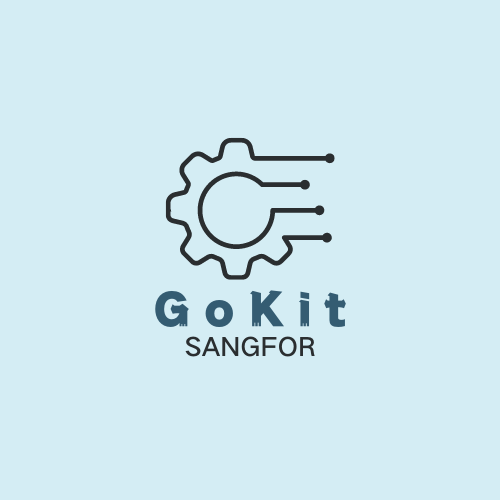

# GoKit

<div align="center">
	
    <p>
        <h1>GoKit</h1>
    </p>
    <p align="center">
        <a href="https://go.dev/dl/" target="_blank">
	        
	    </a>
	</p>
</div>

## 项目简介

* 基于全新Go1.22版本构造的Go基础库
* 面向接口，可以做多种实现，上层业务只需要取用具体的实现类

## 使用文档

[使用文档](./docs/use-gokit.md) · [更新历史](../../../../../../Downloads/gokit/CHANGELOG) · [常见问题](./docs/start-issue.md)

## 特征

* 高生产率： 极强的可扩展性，应用化、模块化、插件化机制敏捷开发。
* 多种实现： 面向接口开发，多种实现，在不同的场景中适应。
* 极致性能： 参考一些论文，考虑 lock-free 与 wait-free 的可能。
* 模块设计: 各个模块分隔合理 

## 内置功能

1. 日志库：全新版本的xlog日志库， 面向接口设计，提供了基于slog的实现，并提供了两种日志轮转实现方式。
2. 对象池：面向接口设计的对象池， 支持泛型，提供了BSON对象的临时对象池。
3. Mongo：
4. 依赖注入：使用 wire 进行依赖注入。
5. 常用工具：集成常用的工具包和命令行工具。

> 更适合高版本Go语言环境，更适合ASM团队Gopher宝宝体质

## gomock

```
mockgen -source=middleware/storage/mongo.go -destination=middleware/storage/test/mongo_mock.go -package=test
```

## License

[Gun © GoKit-2024](../../../../../../Downloads/gokit/LICENSE)
